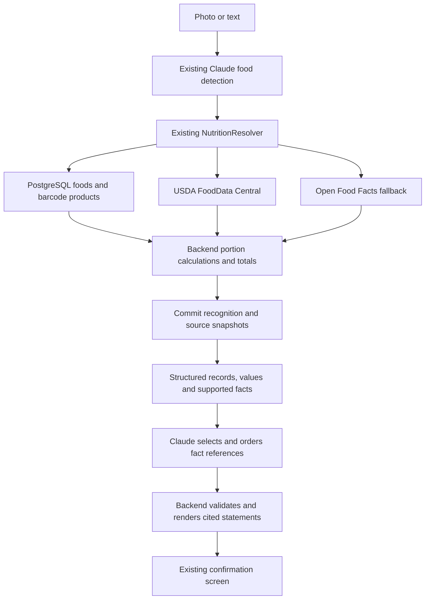

# Grounded nutrition responses

Trueplate retrieves structured food records before composing a response. The existing resolver
is the retrieval module; this pipeline needs neither embeddings nor another database.



## Reused modules and responsibilities

| Module | Responsibility and change |
| --- | --- |
| `services/detection/detector.py` | Unchanged image/text recognition, classification, repairs and nutrition resolution. Its tool schema still prohibits nutrition fields. |
| `services/nutrition/` | Unchanged retrieval, ranking, relevance and plausibility guards, source snapshots and write-backs. Every specific-to-broad term tries local records and USDA before the OFF second pass. |
| `NutritionFacts.for_portion` | Unchanged deterministic portion arithmetic. The response's existing items and totals are authoritative. |
| `schemas/nutrition_context.py` | New typed input to generation: chosen source rows, per-100 g values, estimated grams, portion values, totals and uncertainty. Unresolved nutrition is null. |
| `services/grounding/context.py` | New supported-fact catalog, deterministic comparisons, mandatory caveats and sentence templates. |
| `schemas/grounding.py` | New model-output plan and public grounded-response schemas. |
| `services/grounding/service.py` | New bounded Claude call, reference validation and deterministic fallback. |
| `services/detection/workflow.py` | Adds grounding after committing recognition, for fresh and cached photo/text inputs. |
| `services/detection/cache.py` | Keeps existing keys and TTL; stores a separately versioned summary in the existing JSON payload. |
| `api/deps.py`, `api/routes/ai.py` | Wires the service into existing endpoints. Auth, prompt allowances and Redis rate limits remain in place. |
| `client/src/features/food-logging/` | Displays cited statements and hides them when portions, selected sources or food membership change. |

## Grounding is enforced by the response contract

Claude receives records and calculated values, then composes a response by selecting and ordering
fact IDs. It does **not** supply final prose, calories, macros, quantities or source identifiers.
The backend renders the selected facts and always prepends totals and applicable caveats.

This is constrained generation: phrasing is deliberately limited to backend templates. An open-ended
answer would create a second channel for invented nutrition, including numbers written as words.
The model still chooses which supported portion details and nutrient contributions are most useful.
It cannot provide general dietary advice or assertions outside the retrieved evidence.

The tool schema is generated from Pydantic, with an enum of facts available for that specific meal.
Local validation rejects extra fields, unknown IDs, duplicate selections, more than five selections,
unexpected tools, multiple calls and unfinished responses. Text alongside a valid tool call is
ignored. All context strings are data; original image bytes, free-form notes and user prompts are
not forwarded to this second pass. Source names and detected food labels are never interpolated
into generated statement text.

Strict tools follow [Anthropic's tool contract](https://platform.claude.com/docs/en/agents-and-tools/tool-use/define-tools).
The application also validates references and outcomes locally; provider schema enforcement alone
does not establish that a statement follows from the retrieved food records.

## API compatibility and provenance

`POST /api/v1/ai/detect/photo` and `/text` retain their requests and all existing response fields.
They add `grounded_response`, defaulting to null for older cached payloads and barcode responses:

```json
{
  "grounded_response": {
    "status": "generated",
    "statements": [
      {
        "fact_id": "totals",
        "text": "The matched foods total 330.0 kcal, 62.0 g protein, 0.0 g carbs and 7.2 g fat, based on the estimated portions.",
        "item_indices": [0]
      }
    ]
  }
}
```

Each zero-based item index points to the existing `items` array, whose `matched` field includes
the source, source reference, optional local food ID and per-100 g snapshot. Unresolved caveats
instead point to items with `matched: null`. A seed row remains labeled as a local reference;
neither retrieval nor generation certifies source data or estimated portions as exact.

`status: generated` means Claude selected facts. `status: fallback` means the server selected
the summary and caveats because there were no matches, configuration was missing, or generation
failed. Neither status changes the meaning of `items`, `totals`, `cached` or `is_provisional`.
The `cached` flag describes reused recognition even when an explanation was freshly generated.
Older clients can ignore the additive field, and the new client accepts its absence.

The UI starts with the exact estimated grams, avoiding a rounding difference between the summary
and editable totals. After edits it hides the original summary; existing deterministic recalculation
and saving still run. It makes no extra model calls on each portion edit.

## Failure, cache and operational behavior

Recognition and resolver write-backs commit before generation, so no database transaction remains
open during the additional remote call. A failure returns the same foods and totals with a server
summary. All-unmatched input skips the second call and reports unknown nutrition, never zero-calorie
food. Missing, rough and provisional warnings cannot be suppressed by model selections.

The second call uses the existing Anthropic key, model and effort. `GROUNDING_TIMEOUT_SECONDS`
(default 20) bounds the whole pass, and `GROUNDING_MAX_TOKENS` (default 2000) bounds its output.
SDK retries are disabled for this pass. Request cancellation propagates. A fresh successful meal
normally adds one paid call; a current cached summary adds none. Existing account allowances and
rate-limit accounting remain unchanged.

The detection cache keeps its model, effort, detector prompt/schema fingerprint, input, caption and
meal-type keys. An internal `_grounding_fingerprint` also tracks the response prompt, plan schema,
context/template version, model, effort and generation token budget. A stale or malformed summary
is discarded independently, so only generation repeats. Update `CONTEXT_VERSION` whenever context
or rendered fact semantics change. Summaries keep the same expiry as their detection row.

Fallback summaries are returned but not persisted, allowing the next request to retry generation
without redoing detection. Provisional detections and their summaries are never cached. Existing
PostgreSQL JSON payload storage suffices; there are no migrations or new Redis keys. The barcode
workflow remains independent of Claude.

## Validation

Unit tests cover source context, arithmetic preservation, citations, schema constraints, unsupported
output, instruction-like source text, mandatory warnings, provider failure, timeout and cancellation.
Workflow tests run real FastAPI, detection, resolver and repositories with SQLite, fakeredis, a
substituted Anthropic SDK and HTTP transports. They cover photo/text, local records, USDA and OFF,
cache hits, retry after failure, legacy/versioned/malformed summaries, provisional input and barcode
compatibility. A separate transport test uses the actual Anthropic SDK to check request serialization.

Frontend tests run the real draft conversion and summary rendering, including fractional portions,
edits, source citations and escaped markup. Paid model behavior and live nutrition services are
not part of the automated suite.
